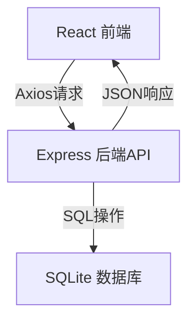

# MyWeb 项目技术栈与结构总结

## 一、项目简介

MyWeb 是一个全栈（Full Stack）Web 应用，支持日记、学习笔记、开销记录的增删改查和数据统计。采用前后端分离架构，数据持久化，界面现代，适合个人成长和项目实践。

---

## 二、前端技术栈

- **React**：构建用户界面，组件化开发，响应式渲染。
- **TypeScript**：类型安全，提升开发体验和代码可维护性。
- **Ant Design (antd)**：企业级 UI 组件库，提供美观易用的表单、按钮、布局、弹窗等。
- **Axios**：前端与后端的 HTTP 通信（AJAX 请求）。
- **React Hooks**：如 useState、useEffect 管理组件状态和副作用。
- **@ant-design/charts**：数据可视化（如饼图、折线图）。

### 主要前端功能
- 日记、学习笔记、开销记录的增删改查
- 数据统计与趋势图表
- 现代响应式界面

---

## 三、后端技术栈

- **Node.js**：JavaScript 运行环境，适合开发高并发 Web 服务。
- **Express**：Web 框架，简化路由、请求处理。
- **CORS**：允许前端跨域访问后端 API。
- **SQLite3**：轻量级嵌入式数据库，适合小型项目和本地开发。
- **原生 SQL**：直接用 SQL 语句进行数据操作。

### 主要后端功能
- RESTful API 设计（/api/diary, /api/study, /api/expense 等）
- 数据持久化（SQLite 数据库 myweb.db）
- 数据统计接口（如 /api/diary/stats）
- 错误处理与日志输出

---

## 四、数据库设计

- **SQLite**：文件型数据库，零配置，适合个人项目和原型开发。
- **表结构**：
  - diary：日记表
  - study：学习笔记表
  - expense：开销记录表

---

## 五、项目结构

- 前端：`client/` 目录
- 后端：根目录下 `server.js`
- 数据库：根目录下 `myweb.db`
- 前后端分离，RESTful API 通信

---

## 六、典型技术流程

---

## 七、适合场景
- 个人日常记录、学习总结、财务记账
- 个人项目、原型开发、全栈学习实践

---

## 八、可扩展方向
- 用户登录/注册（认证与权限）
- 云端部署（如用云数据库、Vercel/Heroku/阿里云等）
- 数据导出/导入
- 更丰富的数据分析与可视化

---

## 九、常见开发与调试经验
- Express 路由顺序很重要，特殊路由（如 /stats）要放在参数路由（如 /:id）之前。
- 日志和接口返回内容是定位问题的关键。
- 遇到接口返回与预期不符时，优先检查路由匹配顺序。

---

## 十、学习建议
- 多实践，结合官方文档学习 React、Express、SQLite。
- 遇到问题多查日志、看接口返回，善用调试工具。
- 逐步尝试添加新功能，提升全栈开发能力。

---

**祝你学习进步，项目越做越好！** 

graph TD
A[React 前端] 

--Axios请求-->   B --JSON响应--> A

B[Express 后端API]

B --SQL操作-->

 C[SQLite 数据库]
